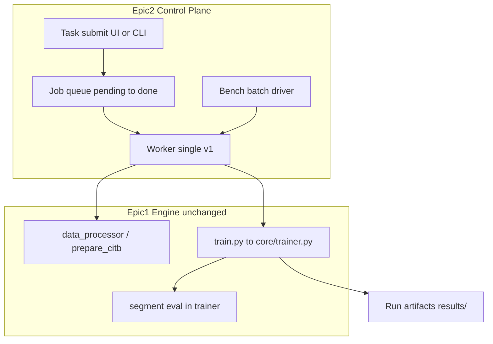
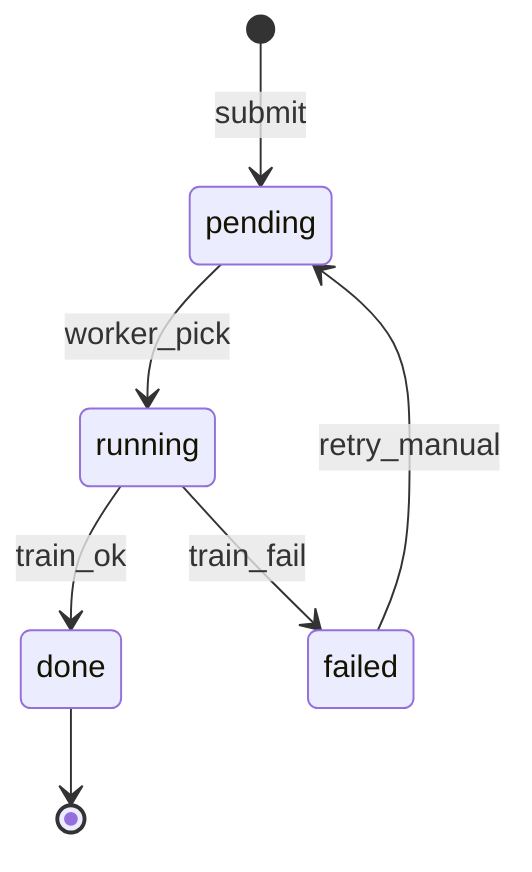

# Epic 2: 任务中心 + LoRA 主线 — 技术方案草案

> **关联 Epic 概要**：[epic-2-experiments.md](./epic-2-experiments.md)  
> **设计主线**：Epic 1 已交付的 **LoRA 持续学习训练管线**；Epic 2 在其上补 **任务中心 / 实验编排**、**Bench 固化**、**统一 Run Artifact**，不重复实现 `core/trainer.py` 与四模块状态机。  
> **刻意不做**：In-Context Learning 路径（属 **Epic 3**）、多 worker / 增量专家 / 超参搜索（见 Epic 2 §9 V1+）。

---

## 1. 与 Epic 1 的边界

| 维度 | Epic 1（已完成 / 主线） | Epic 2（本方案） |
|------|-------------------------|------------------|
| 核心产物 | `core/trainer.py`、`core/stream.py`、`core/modes/*`、四模块、YAML 配置 | 任务提交、排队、Bench 批次、**统一账号口径下的** stream 挂载、run 目录与报表约定 |
| 训练执行 | `train.py` / 脚本直接 `--config` 启动 | **仍调用** 同一 `train.py` + `core/trainer.py`；Epic 2 只包一层 **submit → worker → spawn 训练子进程** |
| 数据 | `scripts/prepare_citb_processed.py` → `data/processed/{stream}/` | 抽象为 **`data_processor` 语义**：幂等规范 segment 流 + `manifest`；可与现有 `prepare_citb_*` **对齐或薄封装**，避免两套格式 |
| 评估 | segment 末 `eval_acc_seen` / `eval_acc_unseen`；`scripts/compute_avg_acc_seen_unseen.py` | **`evaluator` 语义**：V1 复用 trainer 内评估；可选独立 `evaluator.py` 对已有 checkpoint **只跑 eval** |
| In-Context | 不涉及 | **明确排除**；mode 路由在 Epic 3 |

**结论**：Epic 2 = **控制面 + 编排 + 可重复实验契约**，不是第二条训练实现。



---

## 2. V1 目标（先跑通）

| 能力 | V1 最小实现 |
|------|-------------|
| 数据 | **`instrdialog` 单流 MVP**；`instrdialog++` 可 bootstrap 同脚本不同 stream名；幂等：同 `run_id` + 同数据指纹不重复处理 |
| 训练 | 与 Epic 1 相同：YAML → `core/trainer.py`；`configs/default.yaml` 提供**完整**默认（model、lora、train、paths），非仅路径 |
| 评估 | 流式 segment **seen / unseen**；run 级 **avg_acc_seen / avg_acc_unseen**（与 Epic 1 `005-v6-sota-*` 口径一致） |
| 任务中心 | **单页/CLI**：选 stream + mode → `submit` → `status` 轮询；**单 worker** 消费 `pending` |
| Bench | 脚本/API 触发固定批次（多 stream × mode × seed）→ 顺序执行 → 汇总 CSV/MD + **固定报表路径** |
| 可观测 | stdout 日志 + job `status` + artifact 路径；W&B **可选**，默认 off |

**V1 不做**：多 worker 抢占、多 stream 并行、自动超参、合规审计台、Epic 3 `in_context` 训练分支。

---

## 3. 交付物映射（用户草案 → 仓库落点）

| 用户概念 | 建议落点 | 说明 |
|----------|----------|------|
| `data_processor.py` | `scripts/prepare_citb_processed.py` 升级或 `data_processor.py` 薄入口 | 输出 **segment 清单 + 文件**；目录约定见 §5 |
| `train.py` | 现有 `train.py`（或 `core` 包同级） | Worker **子进程**调用，不嵌套 import 长跑 |
| `evaluator.py` | `scripts/eval_only.py` 或 `core/evaluator.py` | V1：trainer 已 eval；独立 evaluator 用于 **resume / bench 只评** |
| `main.py` | `main.py` 或 `control/main.py` | `submit` / `status` / `bench` / `worker` 子命令 |
| `configs/default.yaml` | `configs/default.yaml` + `configs/worker.yaml` | default：**全量训练默认**；worker：轮询间隔、repo_root、device 解析 |
| Bench 报表 | `results/bench_{batch_id}/summary.csv` + `docs/reports/bench_{batch_id}.md`（或 `results/tables/`） | **路径写死**在 bench 配置里，验收可 `test -f` |

---

## 4. 数据处理器（data_processor）

### 4.1 输入 / 输出

| 项 | 约定 |
|----|------|
| 输入 | 原始 CITB（`data/raw/citb` 或配置 `paths.raw_citb_root`） |
| 输出根 | `data/streams/{stream_name}/`（可与既有 `data/processed/{name}_train50_eval10.jsonl` **并存**；V1 推荐统一为 **`manifest.json` + segment 文件**，`core/stream.py` 只认一种） |
| Manifest | `segment_id`、`task_id`、train/eval 路径或内嵌索引、`n_train`、`n_eval` |
| 幂等 | 写入前比对 **content_hash(stream, version, split_rules)**；一致则 skip |

### 4.2 CLI

```bash
python data_processor.py --stream instrdialog [--force]
# 或
python scripts/prepare_citb_processed.py --stream-name instrdialog
```

### 4.3 与 StreamRuntime 契约

- `load_stream_manifest(config)` 读取 `data.streams.{stream_name}.manifest` 或 `paths.processed_stream_dir` 下的 manifest。  
- **破坏性变更**（切分规则、version）→ 递增 `processor_version` → 允许重处理；旧 run 的 artifact 仍指向旧 manifest 快照（submit 时 **拷贝 manifest 指纹进 run 目录**）。

---

## 5. train / evaluator / 配置

### 5.1 训练路径（不变）

```text
config.yaml
  → resolve_paths / auto_prepare_processed（可选，worker 侧先调 data_processor）
  → StreamRuntime
  → get_mode(...)  # ours | sequential | replay | ...
  → Trainer.train()
  → results/{run_name}/metrics.jsonl, checkpoints/, final_metrics.json
```

- **禁止**在 Epic 2 再写一套 segment 循环。  
- **Device**：`model.device: auto` 或 `CUDA_VISIBLE_DEVICES`；禁止业务代码硬编码 `cuda:0`。

### 5.2 evaluator（V1 分工）

| 场景 | 实现 |
|------|------|
| 标准 run | `Trainer` segment 末评估（已有） |
| 仅评估 | `python evaluator.py --config <path> --checkpoint <path>` → 加载权重，跑 `eval_segments`，写 `eval_only_metrics.json` |

指标字段与 Epic 1 对齐：`eval_acc_seen`、`eval_acc_unseen`、`avg_acc_seen`、`avg_acc_unseen`（及 run 级 `final` 块）。

### 5.3 `configs/default.yaml` 结构（须“完整默认”）

```yaml
paths:
  project_root: .
  processed_stream_dir: data/streams
  assets_dir: assets
  results_dir: results

data:
  stream_name: instrdialog
  stream_format: citb_processed  # 或 manifest_v1
  auto_prepare_processed: true
  max_segments: -1

model:
  backbone_name: llama31-8b-instruct
  hf_model_name_or_path: assets/pretrained/meta-llama/Llama-3.1-8B-Instruct
  torch_dtype: bfloat16
  device: auto
  max_seq_len: 512

lora:
  enabled: true
  r: 16
  alpha: 32
  target_modules: [q_proj, v_proj]

train:
  epochs_per_segment: 1
  batch_size: 2
  lr: 2.0e-4

output:
  run_name: auto  # submit 时覆盖为 job_id 或用户命名

experiment_name: epic2_run
mode: ours
seed: 123
```

Worker 合并：`default.yaml` + job 覆盖项 → 写入 `results/runs/{run_id}/config_resolved.yaml`。

---

## 6. 任务中心（单 worker）

### 6.1 状态机



| 状态 | 含义 | 对外字段 |
|------|------|----------|
| `pending` | 已入队 | `run_id`, `stream`, `mode`, `created_at` |
| `running` | worker 占用 | `pid`, `started_at`, `log_path` |
| `done` | 训练结束 | `artifact_dir`, `final_metrics` 摘要 |
| `failed` | 非零退出 / 异常 | `error_message`, `stderr_tail` |

### 6.2 存储（V1）

- **SQLite** `control/state/jobs.db` 或 **JSONL** `control/state/jobs.jsonl`（二选一，V1 推荐 SQLite 便于 `status` 查询）。  
- 表字段：`run_id`, `status`, `stream_name`, `mode`, `seed`, `config_path`, `artifact_dir`, `updated_at`。

### 6.3 API / CLI（最小）

```bash
# 提交
python main.py submit --stream instrdialog --mode ours --seed 123
# 返回: {"run_id": "...", "status": "pending"}

# 查询
python main.py status --run-id <uuid>

# 启动 worker（常驻）
python main.py worker --config configs/worker.yaml
```

可选：**FastAPI** `POST /submit`、`GET /status/{run_id}` 薄封装上述逻辑（单页前端仅 fetch 两接口）。

### 6.4 Worker 行为

1. `SELECT` 最早 `pending` → 置 `running`（V1 **无 CAS**，单进程 worker 即可）。  
2. 若 `auto_prepare_processed`：执行 data_processor。  
3. 写 resolved config → `subprocess`：`python train.py --config ...`。  
4. 成功 → `done` + 填 `artifact_dir`；失败 → `failed`。  
5. 轮询间隔 `poll_interval_sec`（默认 5）来自 `worker.yaml`。

### 6.5 Run Artifact 契约

```
results/runs/{run_id}/
  config_resolved.yaml
  manifest_snapshot.json      # 数据指纹
  metrics.jsonl
  final_metrics.json
  checkpoints/
  train.log                   # worker 重定向 stdout/err
```

`GET status` 在 `done` 时返回 `artifact_dir` 与 `final_metrics` 中 `avg_acc_seen` / `avg_acc_unseen` 摘要。

---

## 7. Bench 模式（回归 / 论文表）

### 7.1 触发

```bash
python main.py bench --bench-id v1_smoke --config configs/bench/v1_smoke.yaml
```

`v1_smoke.yaml` 示例：

```yaml
batch_id: v1_smoke
streams: [instrdialog]
modes: [ours, sequential]
seeds: [123]
report:
  summary_csv: results/bench_v1_smoke/summary.csv
  summary_md: results/bench_v1_smoke/summary.md
```

### 7.2 执行策略

- V1：**顺序** enqueue 或 inline 跑每条 run（不并行占 GPU）。  
- 每条 run：`run_name` = `{batch_id}_{stream}_{mode}_s{seed}`，避免覆盖旧 results。  
- 结束后：聚合 `final_metrics.json` → CSV；MD 表头固定列：`run_name`, `stream`, `mode`, `seed`, `avg_acc_seen`, `avg_acc_unseen`, `CORE_VERSION`。

### 7.3 与「固化 Bench」关系

- Epic 2 §9 的 **bench_runner** 多 stream 全矩阵属 V1+；V1 先 **smoke 子集** + **固定输出路径**，满足「跑过一次就能 diff 报表」。

---

## 8. mode 路由（为 Epic 3 留口）

| mode | V1 行为 |
|------|---------|
| `ours`, `sequential`, `replay`, … | → `core/modes/*` + `Trainer`（Epic 1） |
| `in_context` | **拒绝** submit，或返回 `501` + 文档指向 Epic 3 |

不在 Epic 2 实现 ICL 训练/推理管线。

---

## 9. 目录结构（Epic 2 增量）

```text
Lora-code/
  main.py                      # submit | status | worker | bench
  data_processor.py            # 或 scripts/prepare_citb_processed.py
  train.py                     # 已有
  evaluator.py                 # V1 可选
  control/
    worker.py
    job_store.py
    state/jobs.db
  configs/
    default.yaml               # 完整默认
    worker.yaml
    bench/v1_smoke.yaml
  data/
    streams/{stream_name}/
      manifest.json
      segments/...
  results/
    runs/{run_id}/
    bench_{batch_id}/
      summary.csv
      summary.md
```

---

## 10. 实施顺序（建议 6 步）

| 步 | 内容 | 验收 |
|----|------|------|
| 1 | 统一 stream manifest 与 `core/stream.py` 读路径；`data_processor` 幂等 | 两次 `--stream instrdialog` 第二次 no-op |
| 2 | `configs/default.yaml` 全量字段 + `configs/worker.yaml` | `train.py --config` 无需手工补 key 即可 smoke |
| 3 | `job_store` + `submit` / `status` CLI | submit → pending；fake worker 改 done |
| 4 | `worker` 真调 `train.py` 子进程 | 1 条 ours run → `final_metrics.json` 存在 |
| 5 | `bench` driver + 固定 `summary.csv` 路径 | `bench v1_smoke` 产出 CSV |
| 6 | 文档 + smoke：`instrdialog` + `ours` + seed123 | E2-1～E2-5 对照 Epic 2 验收表 |

---

## 11. 验收清单（对齐 Epic 2）

| ID | 检查项 |
|----|--------|
| E2-1 | `data_processor` 对 `instrdialog` 幂等；manifest 可被 `StreamRuntime` 消费 |
| E2-2 | `submit(stream, mode=ours)` → worker → checkpoint + segment seen/unseen 指标 |
| E2-3 | 训练逻辑仅经 `core/trainer.py`，Epic 2 无重复训练循环 |
| E2-4 | `mode=in_context` 不进入 Epic 2 训练（拒绝或 Epic 3 占位） |
| E2-5 | `bench` 至少 1 批次，`summary.csv` 路径与配置一致 |
| E2-6 | 无生产硬编码 GPU；W&B 默认关可跑通 |

---

## 12. 风险与依赖

| 风险 | 缓解 |
|------|------|
| `data/processed` 与 `data/streams` 双格式 | V1 定一种 manifest；prepare 脚本输出对齐 |
| 单 worker 长队列 | 接受；V1+ 再上 CAS / 多 worker |
| Bench 与 paper `configs/paper/*` 矩阵重复 | bench yaml **引用** 既有 paper config 模板或继承 default |

---

## 13. 变更记录

| 版本 | 日期 | 说明 |
|------|------|------|
| v0.1 | 2026-03-30 | 首版草案：任务中心 + data_processor/train/evaluator/main 映射、单 worker、Bench 报表路径、与 Epic 1/3 边界 |

---

*评审通过后：先落 §10 步 1–4（manifest + worker + 单 run），再 bench smoke。*
